## PA2 - CQRS-GRUPO 3

Este trabajo es para implementar un ejemplo de una Arquitectura CQRS con Event Sourcing, para ello usaremos una entidad que llamaremos StockProdcuto

Funcionalidad   |	Command	|Query
----- | ---- | ---- |
Registrar Producto| SI | NO|
Ingreso Stock| SI | NO|
Salida Stock| SI | NO|
Consulta Stock | NO | SI|

## Frameworks y Herramientas usadas:
+ Spring Boot
+ Axon Framework
+ H2
+ JPA

## Integrantes Grupo 3: 
+ Eveling Castillo Samanez​
+ Luis Felipe Flores Gonzales​
+ Jose Enrique Lluncor Vilela​
+ Yesmi Torres Paucar​
+ Arturo Victorino Vernaza Vargas​
+ Victor Eduardo Torres Tejada​

# Inciando Axon Server
En esta prueba usamos Axon Server desde un docker, este servidor nos permite registrado los eventos por entidades y con esto separar los commands y queries, la siguiente pantalla muestra como iniciar nuestro servidor y la consola web:

## Comando para inicar Axon Server con Docker:
``` docker run -d --name axon-server -p 8024:8024 -p 8124:8124 axoniq/axonserver ```

URL: http://localhost:8024/

## Consola web de Axon 
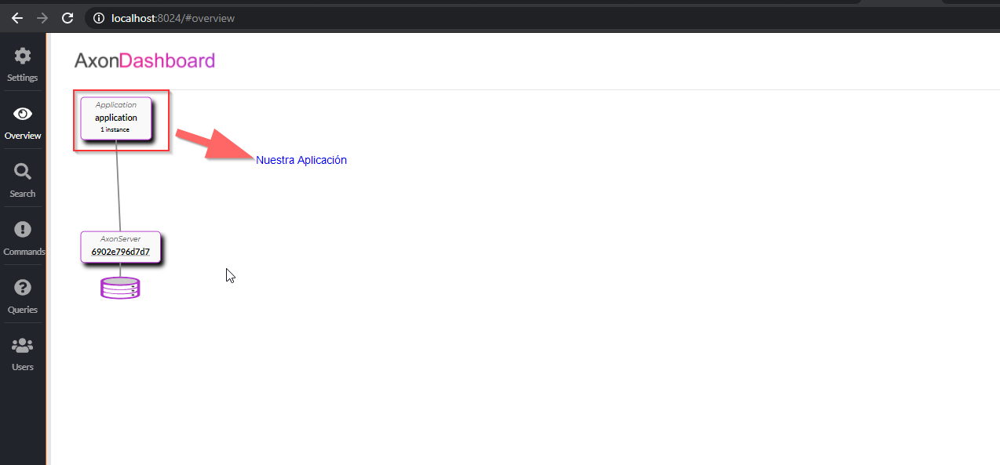

## Commanda
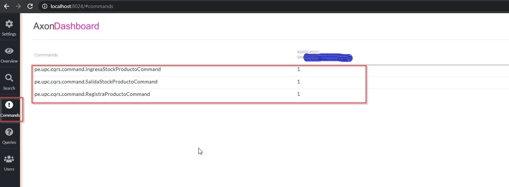

## Quries
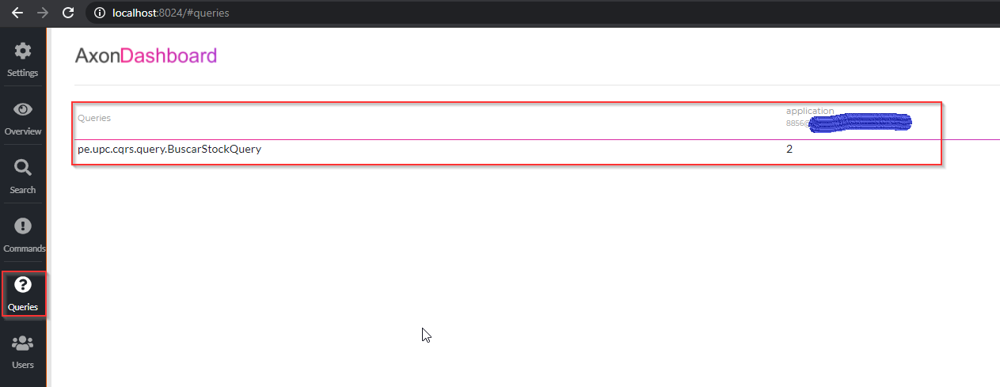

# Pruebas

## Registrar Stock
Esta operación al ser un registro nuevo que cambia el estado de la entidad se debe manejar por un Command.

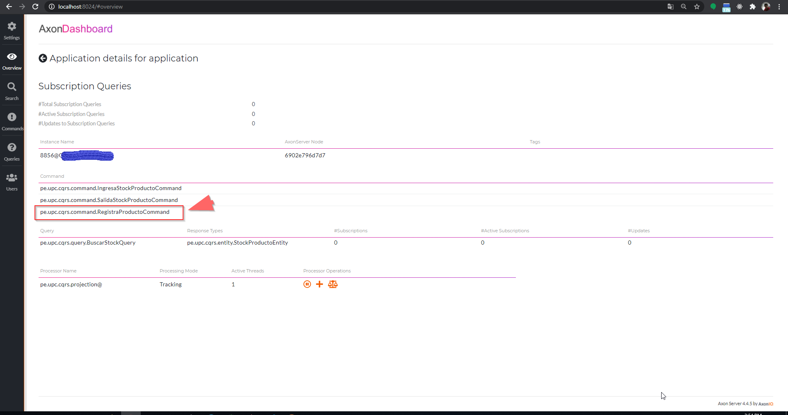

Path: ```curl --location --request POST 'localhost:8080/stock' \
--header 'Content-Type: application/json' \
--data-raw '{
  "nombreProducto": "Laptop DELL",
  "stockInicial": 10
}'```

Imagen
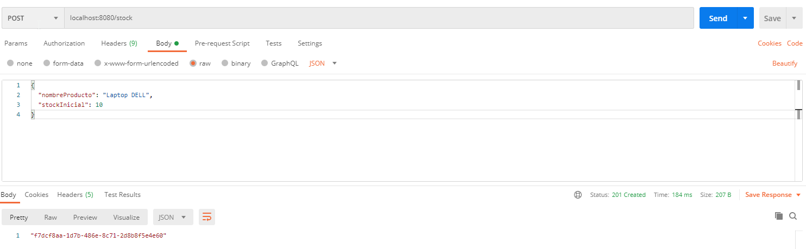

## Ingreso de Stock
Esta operación al ser una actualización que cambia el estado de la entidad se debe manejar por un Command.
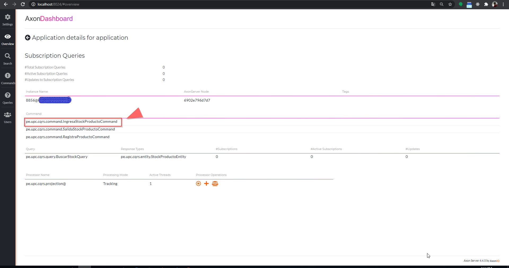

Path: ``` curl --location --request PUT 'localhost:8080/stock/ingreso/f7dcf8aa-1d7b-486e-8c71-2d8b8f5e4e60' \
--header 'Content-Type: application/json' \
--data-raw '{
  "cantidad": 1
}' ```

Imagen
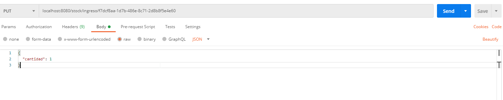

## Salida de Stock
Esta operación al ser una actualización que cambia el estado de la entidad se debe manejar por un Command.
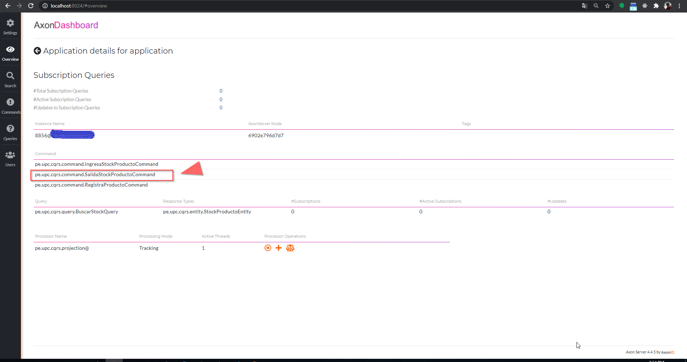

Path: ``` curl --location --request PUT 'localhost:8080/stock/salida/f7dcf8aa-1d7b-486e-8c71-2d8b8f5e4e60' \
--header 'Content-Type: application/json' \
--data-raw '{
  "cantidad": 5
}' ```

Imagen
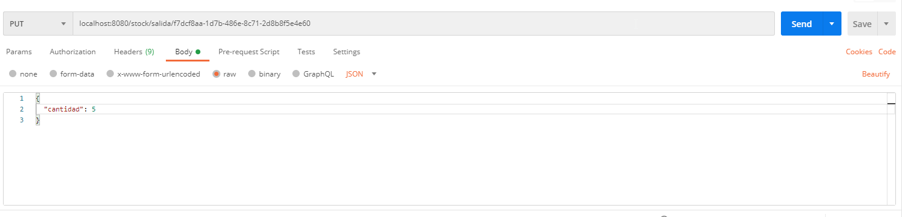


## Consulta de Stock del Producto
Esta operación al ser solo una consulta y no cambia el estado de la entidad se debe manejar por un Query. Según los movimientos realizados tenemos un stock inicial de 10, luego se sumó 1 producto más y finalmente se retiró 5:
Stock: 10+1-5=6


Path: ``` curl --location --request GET 'localhost:8080/stock/f7dcf8aa-1d7b-486e-8c71-2d8b8f5e4e60' \
--header 'Content-Type: application/json' ```

Imagen
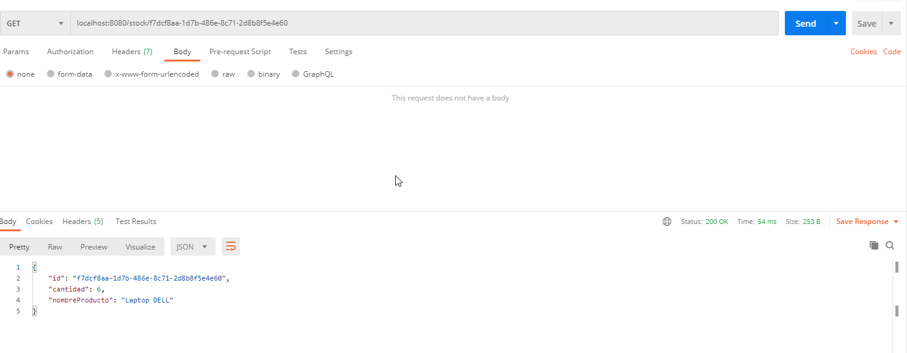

## Consulta de los eventos para el producto
En este servicio podremos ver todos los movimientos sobre el producto:

Path: ``` curl --location --request GET 'localhost:8080/stock/f7dcf8aa-1d7b-486e-8c71-2d8b8f5e4e60/events' \
--header 'Content-Type: application/json' ```

Imagen
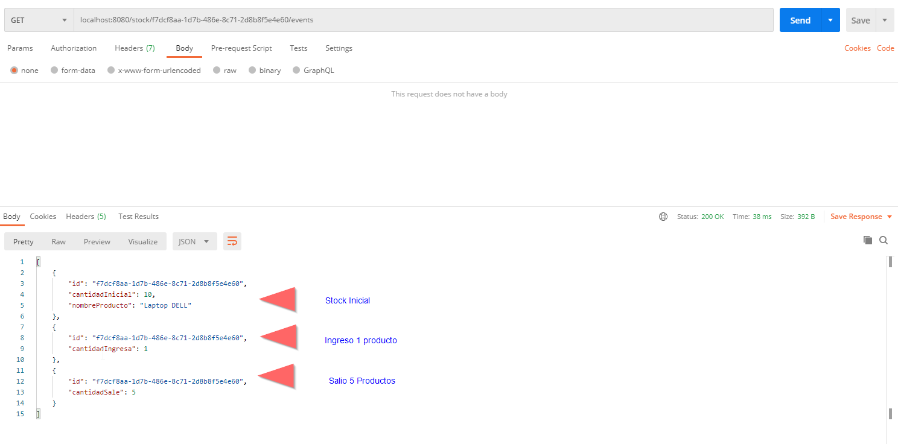


## Referencias: 
Usamos como referencia estas páginas: 
 + https://blog.nebrass.fr/playing-with-cqrs-and-event-sourcing-in-spring-boot-and-axon/
 + https://sgitario.github.io/axon-by-example/

## Nota: 
Los servicios Rest en base a las páginas de referencia usan swagger, por lo que puede ver los servicios expuestos despues de iniciar el proyecto en esta URL: http://localhost:8080/swagger-ui.html 
